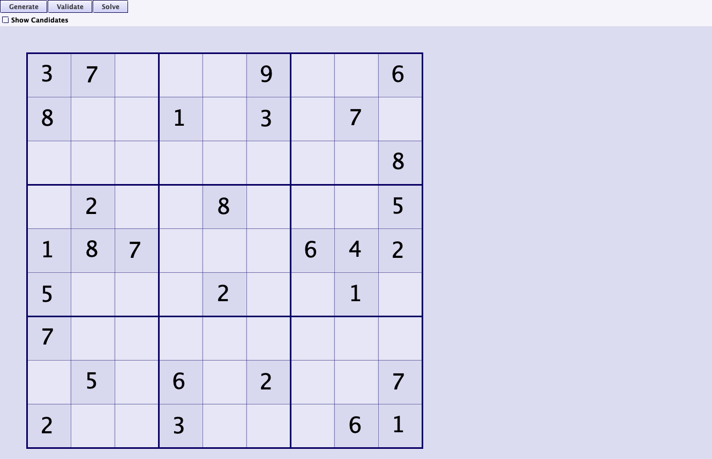
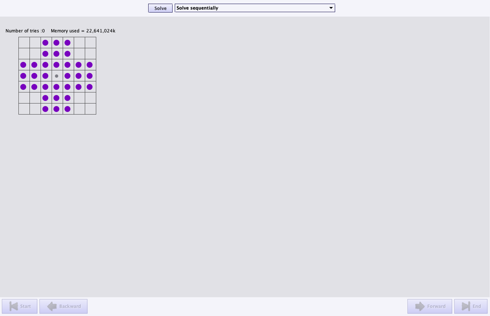
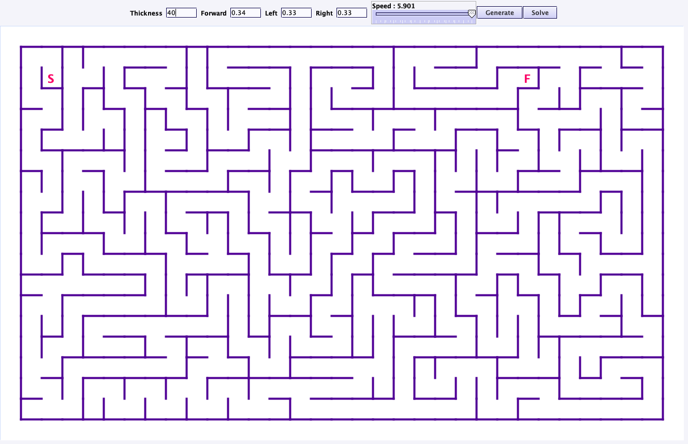
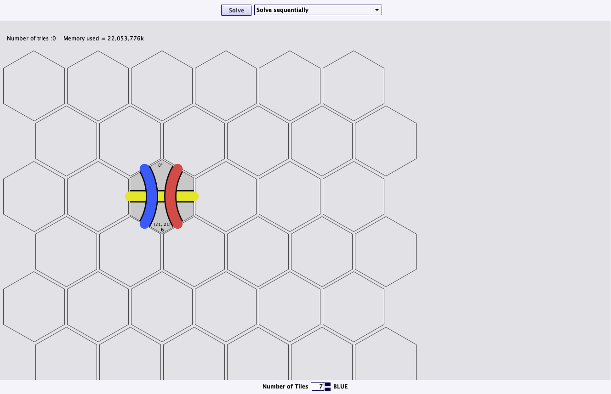

# bb4-puzzles

[](https://github.com/bb4/bb4-puzzles/actions/workflows/ci.yml)

📊 [Build status for all bb4 projects](https://github.com/bb4)

A Scala puzzle framework with generators and solvers for classic puzzles — Sudoku, Hi-Q (peg solitaire), sliding tiles, Rubik’s Cube, Tantrix, mazes, and more. Each app shares a common search/UI framework so you can watch solvers find solutions or play by hand.

## Screenshots









## Puzzles

| Puzzle | Gradle task | Description |
|--------|-------------|-------------|
| [Hi-Q](docs/screenshots/hiq.png) | `runHiq` | Peg solitaire: jump until one peg remains in the center. |
| Sliding Puzzle | `runSlidingpuzzle` | Slide numbered tiles into order. |
| Rubix Cube | `runRubixcube` | Rotate cube layers until each face is a solid color (3D via jMonkeyEngine). |
| [Sudoku](docs/screenshots/sudoku.png) | `runSudoku` | Generate and solve Sudoku boards. |
| [Tantrix](docs/screenshots/tantrix.png) | `runTantrix` | Place hexagonal tiles so colored paths connect (3–30 pieces). |
| [Amazing Maze](docs/screenshots/maze.png) | `runMaze` | Generate mazes with tunable parameters. |
| One Tough Puzzle | `runRedpuzzle` | Nine-piece all-nub jigsaw; brute-force and genetic solvers. |
| Bridge Crossing | `runBridge` | Bridge-and-torch brain teaser: minimize crossing time. |
| Two Pails | `runTwopails` | Measure a target volume by pouring between two containers. |

## Running it

**Option 1 — installer (recommended):** download the installer for your OS from the
[latest release](https://github.com/bb4/bb4-puzzles/releases/latest)
(macOS `.dmg`, Windows `.msi`, Linux `.deb` — one installer per puzzle).

**Option 2 — from source:**

```bash
git clone https://github.com/bb4/bb4-puzzles.git
cd bb4-puzzles
./gradlew runSudoku          # or runHiq, runMaze, runTantrix, …
./gradlew tasks --group application   # list all runnable puzzles
```

The default `./gradlew run` launches the maze generator. Gradle creates a `run<Puzzle>` task for each entry in `appMap`.

## Using it as a library

Published artifacts (latest release **2.1**):

```groovy
implementation 'com.barrybecker4:bb4-puzzle:2.1'          // shared framework
implementation 'com.barrybecker4:bb4-sudoku:2.1'
implementation 'com.barrybecker4:bb4-hiq:2.1'
// also: bb4-slidingpuzzle, bb4-rubixcube, bb4-tantrix, bb4-maze,
//       bb4-redpuzzle, bb4-bridge, bb4-twopails
```

See the [releases page](https://github.com/bb4/bb4-puzzles/releases) if you need a different version.

## What's inside

- **`com.barrybecker4.puzzle.common`** — shared framework: puzzle controllers, Swing viewers/renderers, and solvers (sequential, concurrent, A*, IDA*)
- **Per-puzzle packages** under `com.barrybecker4.puzzle.*` — model, UI, and solver code for each app in the table above
- **`com.barrybecker4.puzzle.rubixcube`** — 3D cube UI built on jMonkeyEngine / LWJGL

## Building from source

See the [Building bb4 Projects wiki](https://github.com/bb4/bb4-common/wiki/Building-bb4-Projects).

## License

MIT — see [LICENSE](LICENSE).
